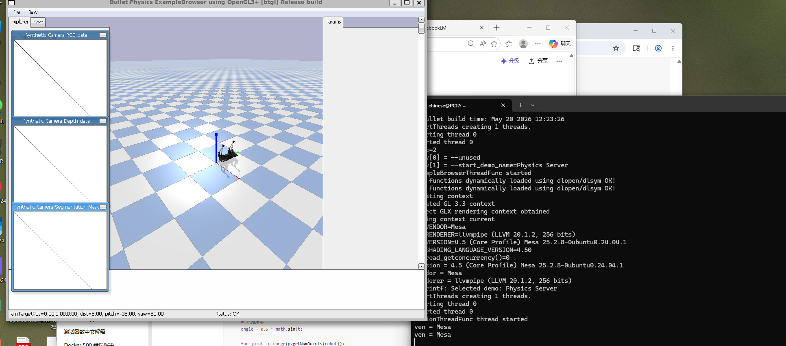

# AI Robotics Homework

本仓库整理了 AI Robotics 课程每周实验与项目。

---

# 在线访问

🔗 https://zone57.github.io/ai-robot--/

---

# 课程作业目录

- [Week 1：WSL 与 ROS2 安装](week1/)
- [Week 2：ROS2 Topic 通信实验](week2/)
- [Week 3：机器人运动控制](week3/)
- [Week 4：Python 与 PyBullet](week4/)
- [Week 5：Linux 与机器人运动学](week5/)
- [Week 6：实验与练习（待补充）](week6/)
- [Week 7：实验与说明](week7/)
- [Week 8：Docker ROS2 环境](week8/)
- [Week 9：ROS2 小乌龟与 Docker](week9/)
- [Week 10：Docker 镜像构建与 OpenCV、PyBullet](week10/)
- [Week 11：四足机器人仿真与 PPO 强化学习](week11/)
- [Week 12：摄像头标定与 Camera Bridge（Flask + SocketIO 实时图像传输）](week12/)
- [Week 13：新增内容与总结](week13/)

---

# 技术栈

- ROS2
- Python
- PyBullet
- Reinforcement Learning
- PPO
- Docker
- OpenCV
- Ubuntu
- WSL2

---

# 项目展示

## 🤖 四足机器人

---

## 🐕 Trot 步态控制

---

# 强化学习

本项目学习并实践了 PPO（Proximal Policy Optimization）强化学习算法，用于训练四足机器人稳定行走。

主要内容包括：

- 状态（State）
- 动作（Action）
- 奖励函数（Reward）
- 策略优化（Policy Optimization）

---

# 项目特色

- ROS2 Topic 通信
- TurtleSim 控制
- OpenCV 图像处理
- Docker 容器实验
- 四足机器人步态控制
- PPO 强化学习训练
- GitHub Pages 自动部署

---

# 关于我

- 姓名：张皓然
- 学号：20231877
- GitHub：zone57
- 课程：AI Robotics

---

# 总结

通过本课程学习了：

- ROS2 通信机制
- Linux 与 Ubuntu
- Docker 基础
- OpenCV 图像处理
- 四足机器人控制
- 强化学习 PPO
- PyBullet 仿真
- GitHub Pages 部署