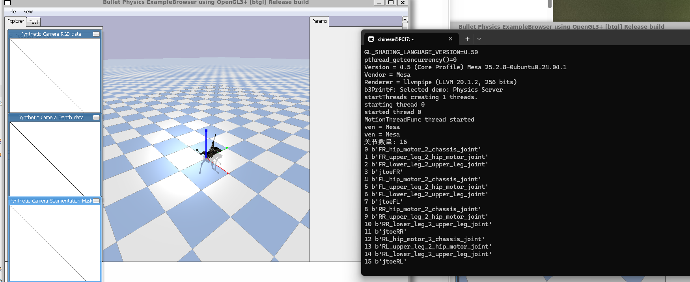

# AI Robotics Homework

本仓库整理了 AI Robotics 课程每周实验与项目。

---

# 在线访问

🔗 https://zone57.github.io/ai-robot--/

---

# 项目内容

## Week 1
WSL 与 ROS2 环境安装

## Week 2
ROS2 Topic 通信实验

## Week 3
机器人运动控制

## Week 4
Python 与 Turtle 仿真

## Week 5
Linux 与机器人运动学

## Week 8
Docker ROS2 环境

## Week 9
ROS2 小乌龟实验

## Week 10
Docker + OpenCV + PyBullet

## Week 11
四足机器人 Trot 步态控制

---

# 技术栈

- ROS2
- Docker
- OpenCV
- PyBullet
- PPO
- Python
- Ubuntu
- WSL2

---

# 项目展示

## 四足机器人

## Trot 步态控制

---

# 关于我

- 姓名：王昕昊
- 学号：20231963
- 专业：软件工程

---

# 项目说明

本项目使用 GitHub Pages 自动部署，
包含 ROS2、Docker、PyBullet、强化学习等机器人实验内容。