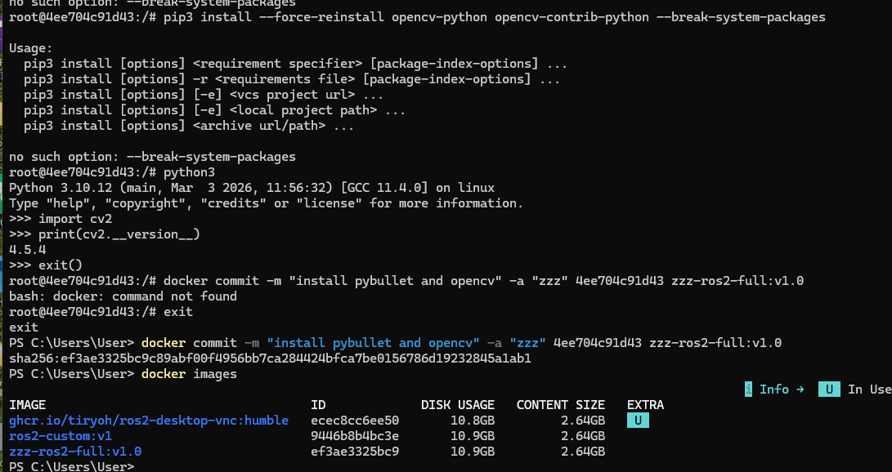
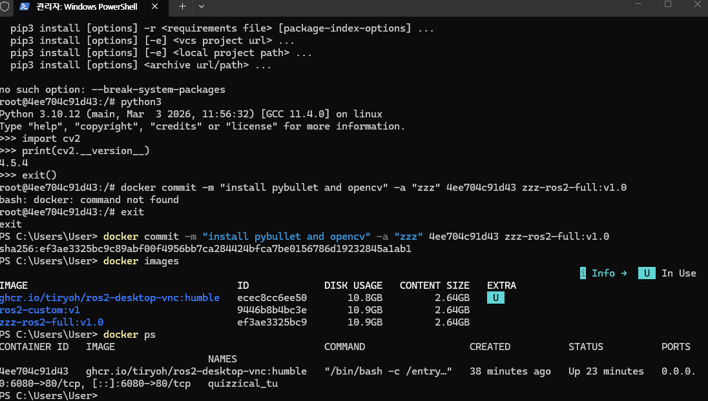

# 🐳 ROS2 Docker 环境配置与 OpenCV、PyBullet 安装实验报告

## 📅 日期

2026-05-13

---

# 🧪 实验目的

* 学习 Docker 容器的基本操作
* 掌握 ROS2 Docker 图形环境运行方法
* 在 Docker 容器中安装 OpenCV 与 PyBullet 库
* 学习 Docker 镜像保存与管理
* 构建完整 ROS2 机器人开发环境

---

# 🖥️ 实验环境

| 项目 | 内容 |
|---|---|
| 操作系统 | Windows 10 + WSL2 |
| Docker版本 | Docker Desktop |
| ROS版本 | ROS2 Humble |
| Python版本 | Python 3.10 |
| 仿真平台 | PyBullet |
| 图像处理库 | OpenCV |
| Docker镜像 | ghcr.io/tiryoh/ros2-desktop-vnc:humble |

---

# 🚀 实验步骤

## 1️⃣ 启动 ROS2 Docker 容器

在 Windows PowerShell 中输入：

```bash
docker run -p 6080:80 --security-opt seccomp=unconfined --shm-size=512m ghcr.io/tiryoh/ros2-desktop-vnc:humble
```

运行后，在浏览器访问：

```text
http://127.0.0.1:6080/
```

成功进入 Ubuntu 图形桌面环境。

---

## 📷 Docker 图形环境



---

## 2️⃣ 查看 Docker 容器

在 PowerShell 输入：

```bash
docker ps
```

输出示例：

```text
CONTAINER ID   IMAGE                                    STATUS
4ee704c91d43   ghcr.io/tiryoh/ros2-desktop-vnc:humble   Up 4 minutes
```

成功获取 Docker 容器 ID。

---

## 3️⃣ 进入 Docker 容器

在 PowerShell 输入：

```bash
docker exec -it 4ee704c91d43 bash
```

成功进入 Docker Linux 环境：

```text
root@4ee704c91d43:/#
```

---

## 4️⃣ 安装 PyBullet

在 Docker 容器终端输入：

```bash
pip3 install pybullet
```

安装完成后，进入 Python 测试：

```bash
python3
```

输入：

```python
import pybullet
```

未出现报错，说明安装成功。

---

## 5️⃣ 安装 OpenCV

安装 OpenCV：

```bash
pip3 install opencv-python opencv-contrib-python
```

---

## 6️⃣ 解决 NumPy 与 OpenCV 兼容问题

安装 OpenCV 后，出现 NumPy 2.x 与 OpenCV 不兼容问题。

错误信息：

```text
ImportError: numpy.core.multiarray failed to import
```

因此卸载 NumPy 2.x：

```bash
pip3 uninstall numpy -y
```

重新安装兼容版本：

```bash
pip3 install numpy==1.26.4
```

---

## 7️⃣ 测试 OpenCV

进入 Python：

```bash
python3
```

输入：

```python
import cv2
print(cv2.__version__)
```

输出结果：

```text
4.5.4
```

说明 OpenCV 安装成功。

---

## 8️⃣ 保存新的 Docker 镜像

退出 Docker 容器后，在 Windows PowerShell 输入：

```bash
docker commit -m "install pybullet and opencv" -a "zzz" 4ee704c91d43 zzz-ros2-full:v1.0
```

系统返回：

```text
sha256:ef3ae3325bc9...
```

说明镜像保存成功。

---

## 📷 新 Docker 镜像



---

## 9️⃣ 查看保存的镜像

输入：

```bash
docker images
```

输出示例：

```text
REPOSITORY          TAG       IMAGE ID
zzz-ros2-full       v1.0      ef3ae3325bc9
```

成功生成新的 Docker 镜像。

---

# 🧠 实验原理

Docker 是一种轻量级容器技术，可以快速部署统一的软件开发环境。

本实验中：

* ROS2 运行在 Ubuntu Docker 容器中
* OpenCV 用于图像处理
* PyBullet 用于机器人物理仿真
* Docker Commit 用于保存当前开发环境

通过镜像保存，可以避免每次重新安装开发环境。

---

# 🎯 实验结果

✅ 成功启动 ROS2 Docker 图形环境

✅ 成功进入 Docker Linux 容器

✅ 成功安装 PyBullet

✅ 成功安装 OpenCV

✅ 成功解决 NumPy 兼容问题

✅ 成功保存新的 Docker 镜像

✅ 成功构建 ROS2 + OpenCV + PyBullet 完整开发环境

---

# ❗ 遇到的问题与解决方法

## 问题 1：OpenCV 无法导入

错误：

```text
ImportError: numpy.core.multiarray failed to import
```

### 原因

NumPy 2.x 与 OpenCV 版本不兼容。

### 解决方法

卸载 NumPy 2.x：

```bash
pip3 uninstall numpy -y
```

安装 NumPy 1.x：

```bash
pip3 install numpy==1.26.4
```

---

## 问题 2：docker: command not found

### 原因

在 Docker 容器内部执行了 Docker 命令。

### 解决方法

退出容器后，在 Windows PowerShell 中执行 Docker 命令。

---

## 问题 3：容器无法进入

错误：

```text
container is not running
```

### 原因

Docker 容器已经停止。

### 解决方法

重新启动容器：

```bash
docker start 4ee704c91d43
```

---

# 📘 实验收获

通过本实验，我不仅掌握了 Docker 容器的基本操作，
还学习了 ROS2 Docker 图形环境部署方法。

同时理解了：

* Docker 镜像与容器关系
* OpenCV 图像处理库安装方法
* PyBullet 机器人物理仿真平台
* Python 科学计算环境兼容问题
* Docker 开发环境保存与迁移

本实验为后续机器人视觉、
强化学习、
四足机器人控制实验提供了完整开发环境。

---

# 🚀 后续计划

后续将在该 Docker 环境中继续完成：

* ROS2 Topic 通信实验
* OpenCV 图像识别实验
* PyBullet 四足机器人控制
* PPO 强化学习训练
* 机器人视觉导航实验

---

# 🧾 实验总结

通过本次实验，我成功构建了基于 Docker 的 ROS2 机器人开发环境，并完成了 OpenCV 与 PyBullet 的安装配置。

实验过程中学习了 Docker 容器管理、镜像保存、Python 库安装以及环境兼容性问题解决方法。同时理解了 Docker 在机器人开发中的重要作用，为后续 ROS2、计算机视觉与机器人仿真开发打下基础。