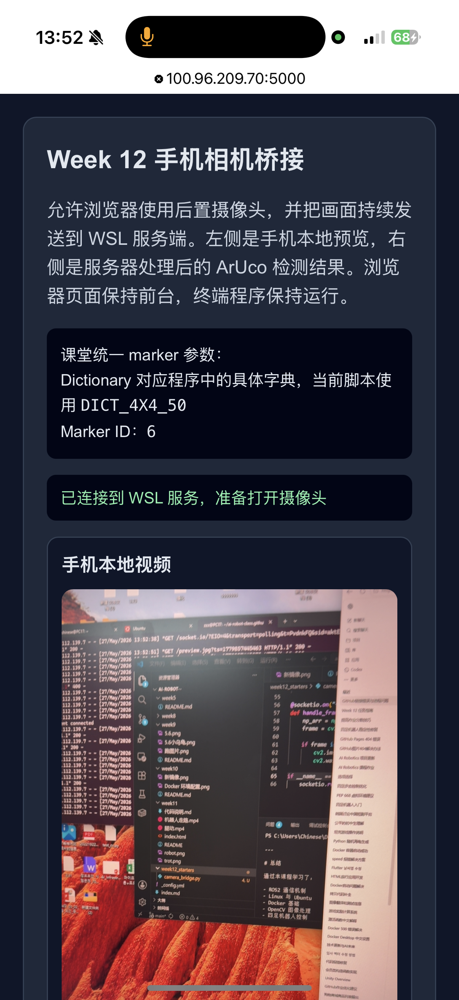
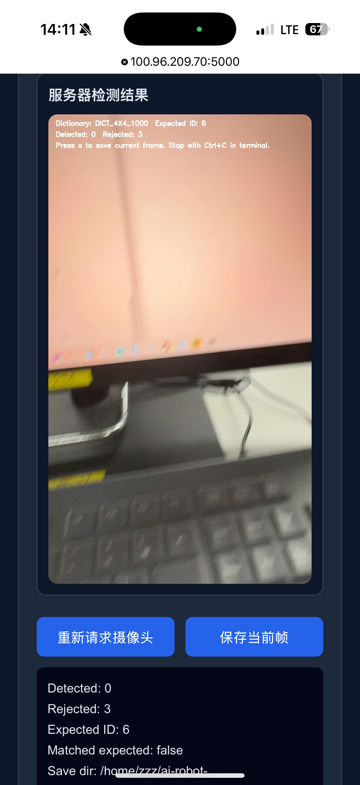
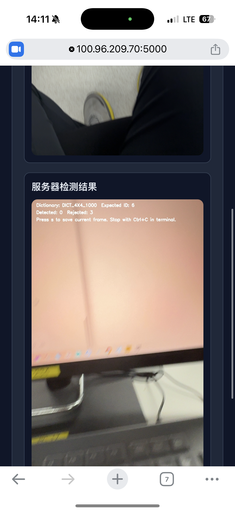

# 🤖 AI Robotics 周报（Week 12 实验进度）

## 📅 日期

2026-05-27

---

# 🧪 一、本周实验内容

本周主要完成了 Week 12 Camera Bridge 与 ArUco Marker 实验，核心内容包括：

* 克隆课程 GitHub 项目仓库
* 配置 Python 虚拟环境（venv）
* 安装 Flask、Flask-SocketIO、Eventlet、OpenCV 等依赖
* 运行 `camera_bridge.py` 摄像头桥接服务
* 使用手机浏览器访问 Flask Camera Bridge
* 学习 ArUco Marker 的生成与检测
* 使用 OpenCV 实现实时 Marker 识别
* 解决 Flask 端口冲突与依赖问题
* 使用 Tailscale 实现手机与电脑通信

---

# ⚙️ 二、环境配置过程

## 1️⃣ GitHub 项目下载

成功克隆课程仓库：

```bash
git clone https://github.com/ai-robot-class/ai-robot-class.github.io.git
```

---

## 2️⃣ Python 环境问题

系统默认缺少 `python` 命令，因此统一使用：

```bash
python3
```

---

## 3️⃣ 安装实验依赖

安装 Flask 与 OpenCV 相关模块：

```bash
pip install flask flask-socketio eventlet numpy opencv-python
```

后续继续安装：

```bash
pip install opencv-contrib-python
```

成功解决：

* Flask 缺失
* Flask-SocketIO 缺失
* OpenCV ArUco 模块缺失
* NumPy 依赖问题

---

# 📷 三、Camera Bridge 实验

成功运行：

```bash
python3 camera_bridge.py
```

服务器启动后显示：

```text
Camera bridge listening on https://0.0.0.0:5000
```

随后使用手机浏览器访问：

```text
https://100.96.209.70:5000
```

成功实现：

* 手机摄像头实时访问
* Flask Web 页面通信
* 浏览器实时图像传输
* 图像保存至 `calib_images/`

---

# 🧩 四、ArUco Marker 实验

## 1️⃣ Marker 生成

本周使用：

```text
DICT_4X4_1000
```

生成：

```text
ID = 6
```

的 ArUco Marker。

---

## 2️⃣ OpenCV 检测

使用 OpenCV ArUco 模块进行检测：

```python
cv2.aruco.detectMarkers()
```

成功识别：

```text
ID: 6
```

并绘制 Marker 边框。

---

## ⚠️ 3️⃣ 重要问题：字典匹配

实验中发现：

Marker 生成使用：

```python
DICT_4X4_1000
```

而原始代码使用：

```python
DICT_4X4_50
```

导致无法识别 Marker。

最终修改：

```python
ARUCO_DICT = cv2.aruco.DICT_4X4_1000
```

后成功检测。

---

# 🧠 五、遇到的问题与解决方法

## ❗问题1：Flask 未安装

解决：

```bash
pip install flask
```

---

## ❗问题2：flask_socketio 缺失

解决：

```bash
pip install flask-socketio
```

---

## ❗问题3：端口占用

运行时出现：

```text
Port 5000 already in use
```

解决方法：

* 修改端口
* 重新启动 Flask 服务

---

## ❗问题4：python 命令不存在

解决：

统一使用：

```bash
python3
```

---

## ❗问题5：ArUco 无法识别

原因：

ArUco 字典不匹配。

解决：

将：

```python
DICT_4X4_50
```

修改为：

```python
DICT_4X4_1000
```

---

# 🚀 六、本周成果

本周成功实现：

✅ Flask Camera Bridge 运行
✅ 手机摄像头实时传输
✅ OpenCV 图像读取
✅ ArUco Marker 实时检测
✅ 成功识别 ID 6
✅ 浏览器与 Python 实时通信
✅ Tailscale 网络访问

---

# 📚 七、本周学习总结

通过本周实验，学习了：

* Flask Web 服务基础
* SocketIO 实时通信
* HTML5 摄像头访问
* OpenCV ArUco 模块
* Camera Bridge 图像传输
* Python 图像处理流程
* Linux 下依赖与端口调试

同时进一步理解了：

* 图像帧传输机制
* 浏览器与 Python 通信方式
* ArUco 字典识别原理
* 实时视觉检测流程

---

# 📌 八、下周计划

* 接入 ROS2 视觉节点
* 学习相机标定
* 学习位姿估计（Pose Estimation）
* 优化图像传输延迟
* 完成 Week 13 四足机器人实验准备

---

# 🖼️ 实验截图

## Camera Bridge 页面



---

## 图像识别结果



---

## ArUco Marker 检测


