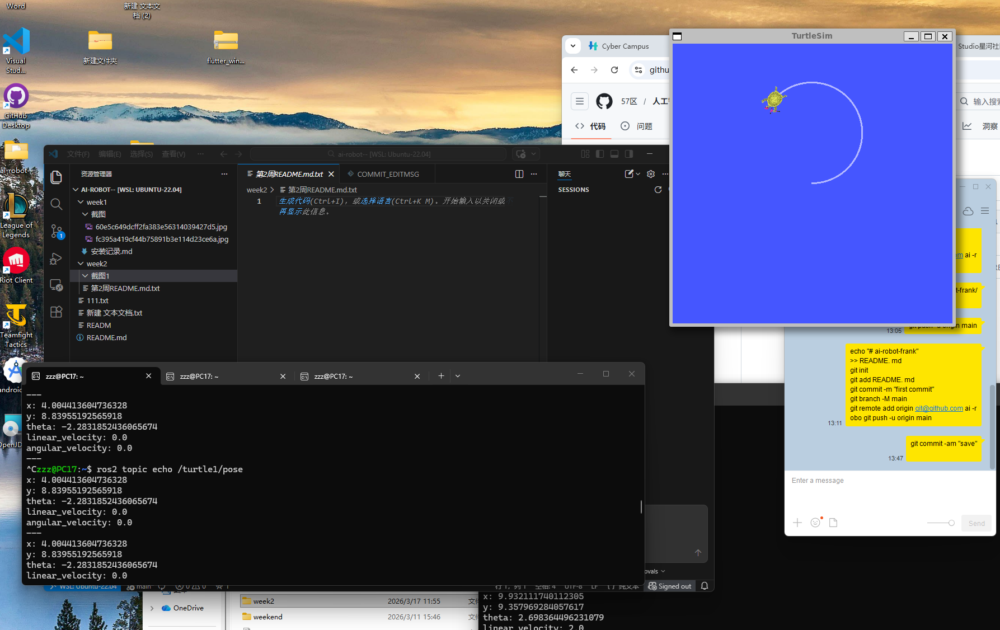
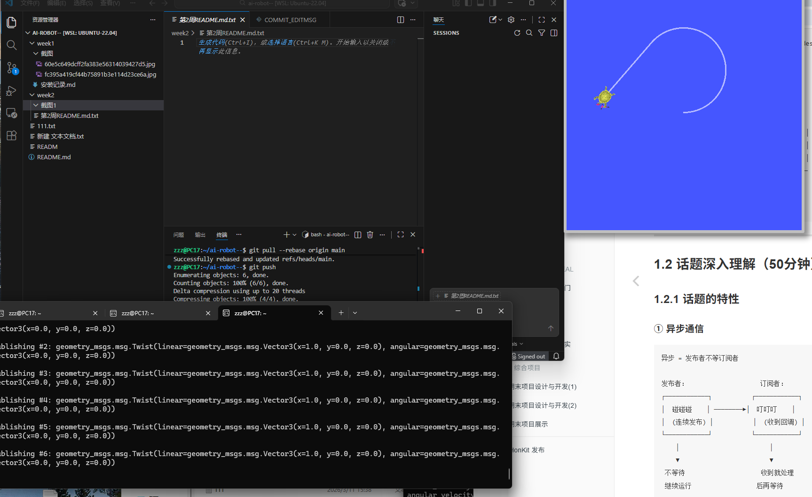

# AI机器人课程 - 第2周作业

## 👤 基本信息

- 姓名：张皓然
- 学号：20231877
- 日期：2026-03-19

---

# 📌 本周目标

- 理解 ROS2 通信机制（Topic）
- 学习 Publisher / Subscriber 模型
- 掌握 ROS2 基本命令
- 实现机器人速度控制

---

# ⚙️ 实验内容

## 1️⃣ ROS2 基本命令实验

### 查看节点

```bash
ros2 node list
```

### 查看话题

```bash
ros2 topic list
```

### 监听位姿信息

```bash
ros2 topic echo /turtle1/pose
```

### 发布速度控制命令

```bash
ros2 topic pub /turtle1/cmd_vel geometry_msgs/msg/Twist "{linear: {x: 1.0}, angular: {z: 0.0}}"
```

---

## 2️⃣ Topic 通信实验

本实验使用 ROS2 Topic 通信机制：

- Publisher 发布速度数据
- Subscriber 接收位姿数据
- 使用 turtlesim 实现机器人控制

---

## 3️⃣ 机器人直线运动实验

通过 `/turtle1/cmd_vel` 控制机器人运动：

- linear.x 控制前进速度
- angular.z 控制转向速度

---

# 📐 运动学公式

机器人圆周运动公式：

:contentReference[oaicite:0]{index=0}

其中：

- v = 线速度
- r = 半径
- ω = 角速度

---

# 🚀 运行结果

## Topic 监听结果



## 小乌龟直线运动



---

# 💡 核心知识点

## Topic（话题）

ROS2 中节点之间异步通信方式。

## Publisher（发布者）

负责发送消息。

## Subscriber（订阅者）

负责接收消息。

## Twist 消息

用于机器人速度控制：

- linear.x → 前进速度
- angular.z → 旋转速度

---

# ⚠️ 遇到的问题与解决

## 问题1：节点无法通信

### 原因

Topic 名称不一致。

### 解决

统一发布与订阅的 Topic 名称。

---

## 问题2：机器人不运动

### 原因

速度参数设置错误。

### 解决

检查 `/turtle1/cmd_vel` 参数格式。

---

# 🧠 本周总结

本周学习了 ROS2 核心通信机制 Topic。

通过实验：

- 掌握了 Publisher / Subscriber 模型
- 学习了 ROS2 基本命令
- 完成了 turtlesim 机器人控制
- 实现了机器人直线运动

为后续 ROS2 节点开发与机器人控制实验打下基础。