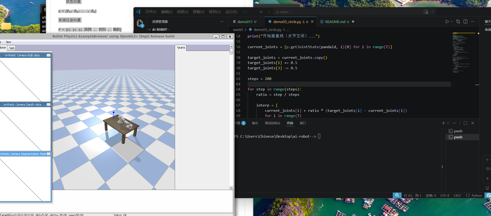
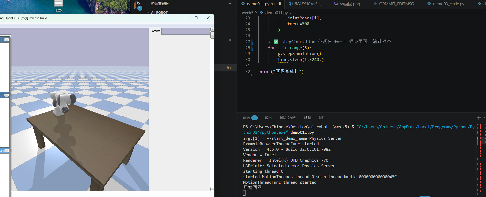

# 🤖 AI机器人课程 - 第4周作业

## 👤 基本信息

* 姓名：张皓然
* 学号：20231877

---

# 📌 本周目标

* 学习 Python 基础控制
* 熟悉 ROS2 turtlesim 环境
* 使用速度控制实现机器人画圆
* 理解机器人运动学基础

---

# ⚙️ 实验内容

本周实验基于 ROS2 与 turtlesim 完成机器人圆周运动控制。

实验主要内容包括：

* 使用 Python 发布速度控制指令
* 控制机器人绘制圆形轨迹
* 调整线速度与角速度参数
* 观察不同参数对轨迹的影响

---

# 💻 ROS2 控制命令

## 发布速度命令

```bash id="t4g92h"
ros2 topic pub /turtle1/cmd_vel geometry_msgs/msg/Twist \
"{linear: {x: 2.0}, angular: {z: 1.0}}"
```

---

# 📂 代码文件

* demo011.py
* demo03_circle.py
* demo04_circle.py

---

# 📐 运动学公式

机器人圆周运动关系：

```text id="7d3r5x"
v = r × ω
```

其中：

* v：线速度（linear velocity）
* r：圆半径（radius）
* ω：角速度（angular velocity）

---

# 🚀 实验结果

## 圆形轨迹实验



---

## 大圆轨迹实验



---

# 💡 核心知识

## Twist 消息

ROS2 中用于机器人速度控制的重要消息类型。

---

## linear.x

控制机器人前进速度。

---

## angular.z

控制机器人旋转速度。

---

# ⚠️ 问题与解决

## 问题

机器人运动轨迹不够平滑。

---

## 原因

线速度与角速度比例不合理。

---

## 解决方法

通过调整 `linear.x` 与 `angular.z` 参数比例，使机器人保持稳定圆周运动。

---

# 🧠 本周总结

通过本周实验：

* 学习了 ROS2 基础控制方式
* 理解了机器人运动学原理
* 掌握了 turtlesim 控制方法
* 学会了通过速度参数实现圆周运动

为后续机器人导航与运动控制实验打下基础。
