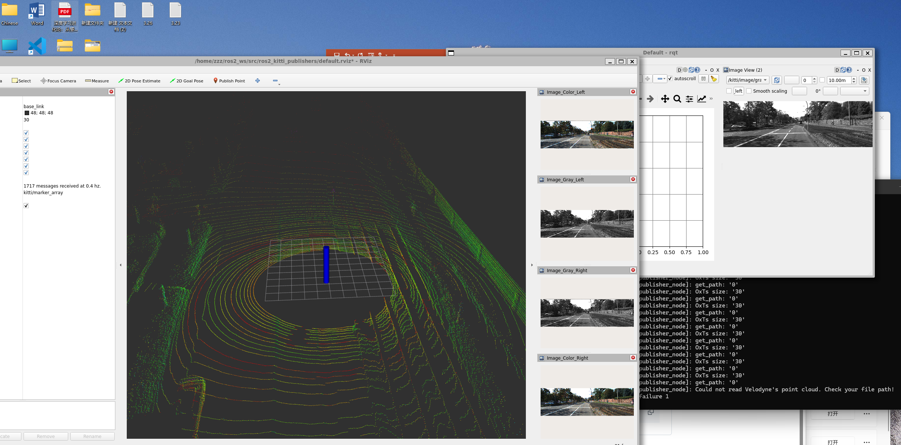
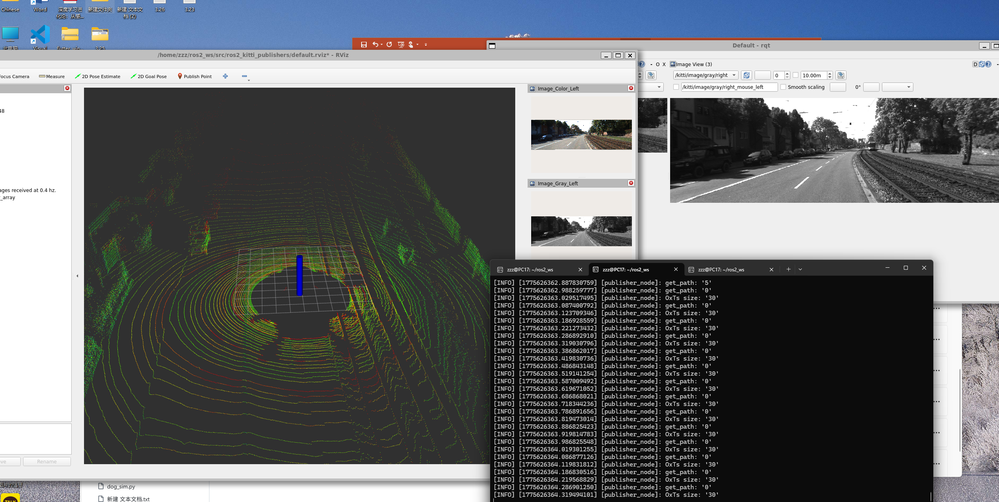

# AI机器人课程 - 第6周作业

## 👤 基本信息

- 姓名：张皓然
- 学号：20231877

---

# 📌 本周目标

- 实现机器人监视器
- 显示实时数据
- 学习 ROS2 Topic 订阅机制

---

# ⚙️ 实验内容

本实验基于 ROS2 turtlesim 环境，实现一个简单的机器人监视器。

主要功能：

- 订阅 `/turtle1/pose`
- 实时显示乌龟位置
- 显示速度与方向信息
- 监控机器人运动状态

---

# 🧩 核心代码

```python
self.create_subscription(
    Pose,
    '/turtle1/pose',
    self.pose_callback,
    10
)
```

通过订阅 pose topic，实现实时数据更新。

---

# 🚀 实验结果

## 监视器窗口



## 数据输出



---

# 🎥 视频演示

## 运行视频

监视器.mp4

---

# 💡 核心知识

- ROS2 Topic 通信
- Subscriber 订阅机制
- turtlesim 位姿信息
- 实时数据刷新

---

# ⚠️ 问题与解决

## 问题

数据更新不稳定。

## 原因

订阅频率设置过低。

## 解决方案

提高 callback 更新频率。

---

# 🧠 实验总结

本实验完成了基础机器人监视系统开发。

通过订阅 `/turtle1/pose`：

- 学习了 ROS2 通信机制
- 掌握了实时数据监控
- 理解了机器人状态反馈原理

为后续机器人控制与强化学习实验打下基础。